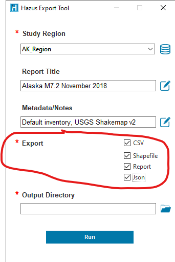
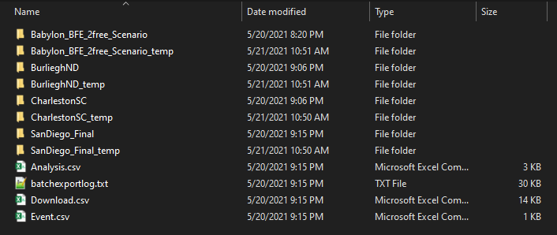
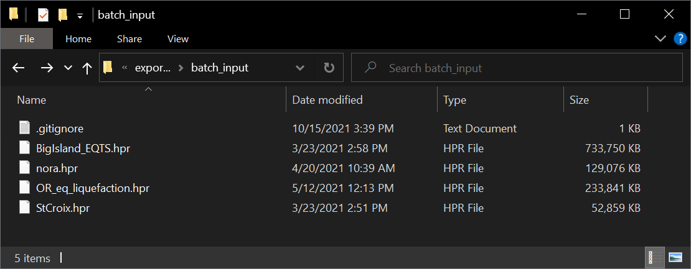
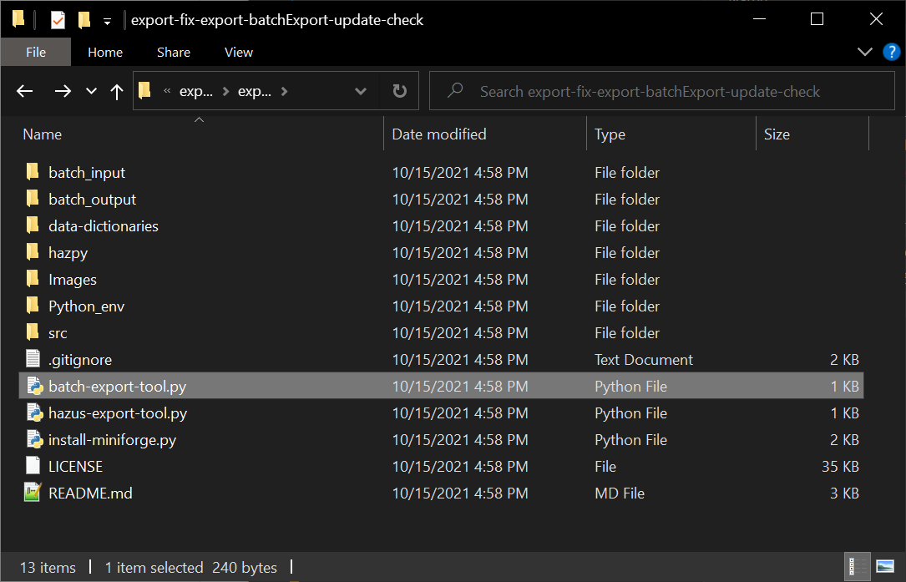

# Hazus Export Tool

The Hazus Export Tool summarizes Hazus risk assessment results stored on your desktop Hazus database in a handful of text files, shapefiles, and a one-page graphic report. 

## Requirements

The Hazus Export tool requires Hazus, ArcGIS Desktop, and conda to be installed on your computer. If you haven't already, follow this [README](https://github.com/nhrap-hazus/Environment-Setup) to setup your machine with miniforge and conda before trying to run Export.

## Documentation
Please refer to the guide sheets in the [data-dictionaries](/data-dictionaries) folder for information about the fields, values, and units found in exported HAZUS results data.

## To Use

Follow the steps below to run Export.

**1. Download zip folder from GitHub, then unzip.**

**2. Double-click "hazus-export-tool.py".**

**3. Select a study region from the drop-down list.**

**4. Select summary information to export.**

**5. Provide a Report Title and type notes about your selected Hazus analysis (model inputs, date, settings, version, etc.). Metadata are required to share your model results with FEMA!**

**6. Select a folder destination for exported files.**

**7. Click "Export".**

# Hazus Batch Export Tool

The Hazus Batch Export Tool is used to run the Hazus Export Tool on one or more Hazus Package Region (.hpr) files and generates metadata for batch uploads to Hazus Loss Library (HLL). HPR files are exported Hazus Study Region files.

## Documentation

**Hazus Version Support:**

* The batchExport script has been tested on HPR created by Hazus 3.1 and up. 
  * Hazus 3.0 created HPR and lower will likely fail and are not supported. The script will skip over them.
  * For HPR versions lower than 3.1 it's recommended to use Hazus 4.2.3 or newer be used to create the HPR.
    * There was a large restructuring of Hazus in 3.0 and the datum change probably happened in 3.1.
* There is a script ("batchHPRComment.py") in python_env that is used to obtain the version of Hazus used to create the .hpr. It will also notify if the HPR is not a valid zipfile and would thus fail to be run in the batchExport script.

**Hazus Loss Library (HLL) Metadata:**

There are three csv files named 'Analysis.csv', 'Download.csv', and 'Event.csv' that should exist in the batchExport output folder 
for each HPR file/StudyRegion, these are specific to that HPR and contain relative paths, however these relative paths are set for
the next folder up. A the parent/root folder of the batchexport output (as defined by the user in the batchExport.py) there are 
three csv files named 'Analysis.csv', 'Download.csv', and 'Event.csv' that are the aggregated files from each HPR. These csv files
are the HLL Metadata files and are used by the HLL batch upload process.

If a user is running multiple batches there is another script ("batchExportPostHLLMetadataAggregate.py") that can be used to 
regenerate those main HLL metadata files. Follow the same steps to run batchExport.py however you only need to designate 
the input folder that contains all of the hpr batchexport output folders with the three HLL metadata files each.

HLL uses field validation for data types and fields with choices (e.g. hazard, analysisType), but for fields like source, any string will do.
Therefore if it says something like "FIX ME: USER INPUT NEEDED", it is possible to upload it like that.

Also note that if you are using excel to view the csv files that it will try and determine the data type for each
column and display it with defaults. This is most noticeable with dates where the csv its stored as YYYY-MM-DD but
excel may display it as MM-DD-YYYY.

#### Output Folder ####

* For each batch export script run it will generate the output folder which includes a folder for each HPR file, the 
HLL Metadata files (Event.csv, Analysis.csv, Download.csv) and a logfile. The HPR folder will have a directory for each
hazard, scenario, return period permutation and files in different directories depending on their relationship to the event.
* If the batchExport.py script option of deleting the temp directory is set to 1/true then the *_temp folders will be deleted.
* The batchexportlog.txt contains debug level information of the script run and timestamp and run time. This is a good spot to check for any errors or issues for an HPR.

#### Event.csv ####

* User can change the name. Max 50 characters (may be larger).
* If the even is historic then it should have a value in the date field in YYYY-MM-DD format.
* Required fields: id, name

#### Analysis.csv ####

* You can change the 'name' field to change what HLL displays. Max 100 characters (may be larger).
* The 'date' refers to the date of the scenario analysis. 
  * Hurricane, Tsunami HPR do not yet have Analysis Date
  * Needs to be in 'YYYY-MM-DD' format
* You can change 'modifiedInventory' to true or false. Default is false.
* You can change the 'source'. Max 100 characters (may be larger).
* Meta can contain any info.
  * This is a json object or python dictionary, one level deep.
  * Need to use double quotes and separate each item by spaces i.e. {"firstname":"Patty","nickname":"Pat"}
* event must match an id in Event.csv
* Required fields: id, name, hazard, analysisType, date, source, modifiedInventory, event

**Renaming Study Regions and Scenarios for HLL:**

To rename the Study Region you can open the 'Event.csv' and modify the value in the 'name' field.

To rename the Scenario you can open the 'Analysis.csv' and modify the value in the 'name' field.

#### Download.csv ####

* You can add a url to the 'link' field for a row and HLL button for that item will open the link instead of the file.
* Category and subcategory can be changed to group and sort the files for an analysis.
* Probabilistic analysis will have an Annual return period and it will not have a hazardBoundaryPoly.zip.
* Meta can contain any info.
  * This is a json object or python dictionary, one level deep.
  * Need to use double quotes and separate each item by spaces i.e. {"firstname":"Patty","nickname":"Pat"}
* analysis must match an id in Analysis.csv
* Required fields: id, category, subcategory, name, icon, analysis

## Requirements

Same as Hazus Export except that Batch Export cannot be run from a User's folder such as Documents, Downloads, etc due to permissions issues when restoring the hpr to SQL Server. It is recommended that you copy the unzipped folder to your C drive before running the tool.

## To Use

Follow the steps below to run Batch Export. 

It's recommended that if you want to rerun an HPR that you should delete or rename the previous run's output folder for that HPR. 

**1. Place your .hpr files into the batch_input folder**

**1b. Adjust the desired outputs by modifying the values in the 'hazpy/batch_export.py'**
Look near the very bottom of the script for these entries:

    #USER DEFINED VALUES
    hprDir = Path.absolute(Path(r'./batch_input'))      #The directory containing hpr files
    outDir = Path.absolute(Path(r'./batch_output'))     #The directory for the output files
    _outCsv = 1         #Export csv files: 1 to export or 0 to skip
    _outShapefile = 1   #Export shapefiles: 1 to export or 0 to skip
    _outReport = 1      #Export report pdf files: 1 to export or 0 to skip
    _outJson = 1        #Export json files: 1 to export or 0 to skip

If you want to export only the reports, then it would need to look like this:

    #USER DEFINED VALUES
    hprDir = Path.absolute(Path(r'./batch_input'))      #The directory containing hpr files
    outDir = Path.absolute(Path(r'./batch_output'))     #The directory for the output files
    _outCsv = 0         #Export csv files: 1 to export or 0 to skip
    _outShapefile = 0   #Export shapefiles: 1 to export or 0 to skip
    _outReport = 1      #Export report pdf files: 1 to export or 0 to skip
    _outJson = 0        #Export json files: 1 to export or 0 to skip

**2. Double-click 'batch-export-tool.py'. If you don't have the Hazus Python Library installed, follow the prompt to install, then double-click 'batch-export-tool.py' again**

**3. Check the 'batch_output' folder for the output**

**4. For HLL, in the 'batch_output' folder replace "FIX ME" field values in the "Event.csv", "Analysis.csv" and "Downloads.csv" files**

**Script Failure:**

If the script fails without dropping the bk_* (where * is the name of the hpr file or its .bk sql server backup database) database, then you will need to do it manually. Using SQL Server Management Studio you can DELETE the bk_* database and using Windows explorer you can delete the temp folder that contains the unzipped contents of the HPR file.

## Contact

Please report issues through the [Export GitHub repository](https://github.com/nhrap-hazus/export)

For questions: contact fema-hazus-support@fema.dhs.gov
