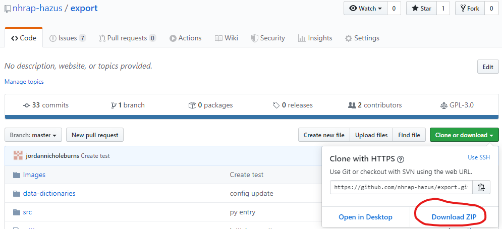
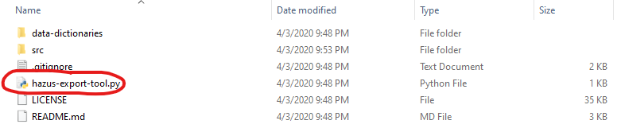
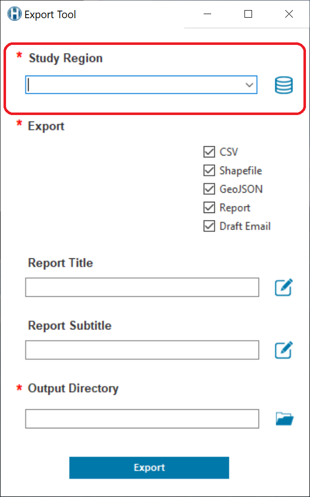
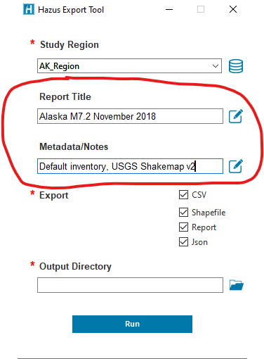
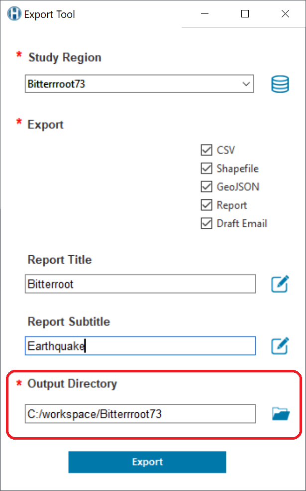
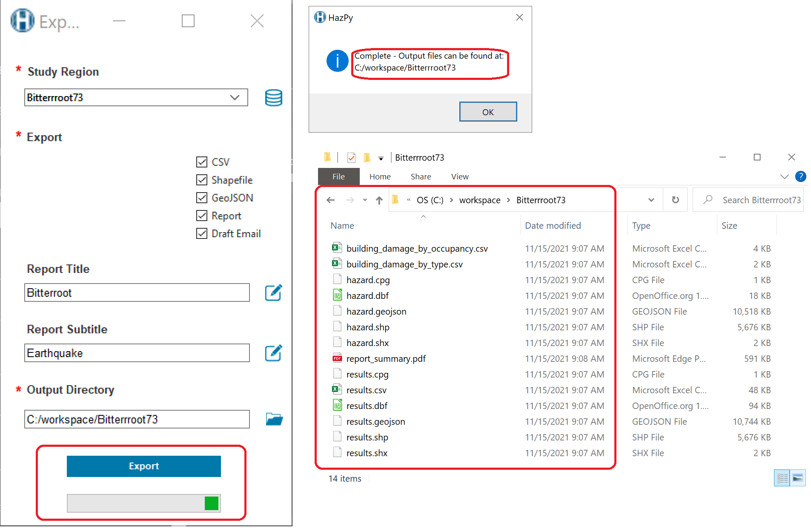

# Hazus Export Tool

The Hazus Export Tool summarizes Hazus risk assessment results stored on your desktop Hazus database in a handful of text files, shapefiles, and a one-page graphic report. Launch the tool by double-clicking the "hazus-export-tool.py" file in the download folder.

The Hazus Export Tool is developed using the Hazus Python Package, HazPy. HazPy tools automatically check for updates each time they are opened. Hazus Python Package documentation is found here: https://github.com/nhrap-hazus/hazus

## Requirements

The Hazus Export tool requires Hazus, ArcGIS Desktop, and Anaconda to be installed on your computer. Anaconda is a free software that automatically manages all Python packages required to run Hazus open source tools - including the Hazus Python package: https://fema-nhrap.s3.amazonaws.com/Hazus/Python/build/html/index.html

1. Go to https://www.anaconda.com/distribution/

2. Download Anaconda for Python 3

3. Complete the installation. During installation, make sure the following options are checked:

   - [x] **Add Anaconda to my PATH environment variable**
   - [x] Register Anaconda as my default Python

## Documentation

For information about the fields, values and units found in exported Hazus results data, please refer to the guide sheets in the data-dictionaries folder: "EQDataDictionary", "TSDataDictionary", "FLDataDictionary", and "HUDataDictionary". https://github.com/nhrap-hazus/export/tree/master/data-dictionaries 

## Contact

Issues can be reported through the repository on Github (https://github.com/nhrap-hazus/export)

For questions contact hazus-support@riskmapcds.com

## To Use

Follow the steps below to run FAST. To ensure .py files run when double-clicked:

1. Right-click the .py file and go to Properties. 
2. Under the "General" tab next to "Opens With", make sure "python.exe" is selected. If not, click "Change" and select "python.exe" from your Python installation directory.

**Must have Anaconda Python 3.7 installed. Please read requirements.**

1. Download zip folder from GitHub, unzip.

2. Double-click "hazus-export-tool.py". If you don't have the Hazus Python Library installed, follow the prompt to install, then double-click "hazus-export-tool.py" again

3. Select a study region to export from those stored in your dekstop Hazus database, as shown in the drop-down menu.

4. Provide a Report Title and type notes about your selected Hazus analysis (model inputs, date, settings, version, etc.). Metadata are required to share your model results with FEMA!

5. Select summary information to export and a folder destination for exported files.

6. Click "Run".

