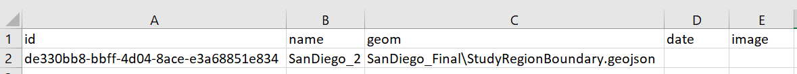
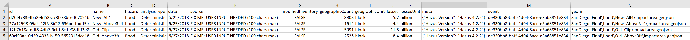
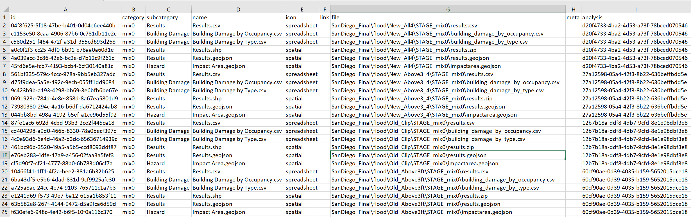
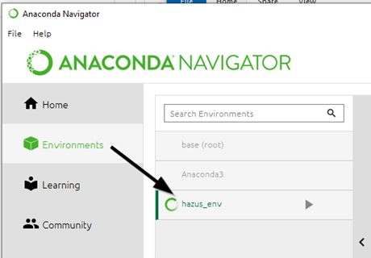
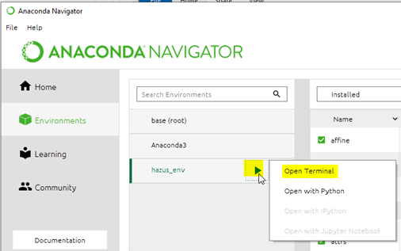

# Hazus Batch Export Tool

The Hazus Batch Export Tool is an extension of the Hazus Export Tool that is meant for running Export on multiple Hazus Package Region (HPR) files 
(Hazus exported Study Region) within a directory. 

## Requirements

The Hazus Export tool requires Hazus, ArcGIS Desktop, and Anaconda to be installed on your computer. Anaconda is a free software that automatically manages all Python packages required to run Hazus open source tools - including the Hazus Python package: https://fema-nhrap.s3.amazonaws.com/Hazus/Python/build/html/index.html

1. Go to https://www.anaconda.com/distribution/

2. Download Anaconda for Python 3

3. Complete the installation. During installation, make sure the following options are checked:

   - [x] **Add Anaconda to my PATH environment variable**
   - [x] Register Anaconda as my default Python

4. Download the zip folder of Export from GitHub and unzip it.

5. Run the Hazus Export Tool to install hazpy in the hazus_env Anaconda virtual environment (Read the README for the Hazus Export Tool on the steps)

6. If the python package 'xhtml2' is not installed in the Anaconda 'hazus_env' virtual environment you may need to do so manually using Anaconda. It will also install six other required python packages.

## Documentation

For information about the fields, values and units found in exported Hazus results data, please refer to the guide sheets in the data-dictionaries 
folder: "EQDataDictionary", "TSDataDictionary", "FLDataDictionary", and "HUDataDictionary". https://github.com/nhrap-hazus/export/tree/master/data-dictionaries 

**Hazus HPR Version Support:**

* The batchExport script has been tested on HPR created by Hazus 3.1 and up. 
* Hazus 3.0 created HPR and lower will likely fail. 
* For HPR versions lower than 3.1 it's recommended to use Hazus 4.2.3 or Hazus 5.0 to recreate the HPR.
  * There was a large restructing of Hazus in 3.0 and the datum change probably happened in 3.1.

There is a script (batchHPRComment.py) in python_env that can be used to look in a directory and subdirectory for HPR files and read out what version of Hazus they
were created by. It will also notify if the HPR is not a valid zipfile and would thus fail to be run in the batchExport script.

**Hazus Loss Library (HLL) Metadata:**

There are three csv files named 'Analysis.csv', 'Download.csv', and 'Event.csv' that should exist in the batchExport output folder 
for each HPR file/StudyRegion, these are specific to that HPR and contain relative paths, however these relative paths are set for
the next folder up. A the parent/root folder of the batchexport output (as defined by the user in the batchExport.py) there are 
three csv files named 'Analysis.csv', 'Download.csv', and 'Event.csv' that are the aggreagted files from each HPR. These csv files
are the HLL Metadata files and are used by the HLL batch upload process.

If a user is running multiple batches there is another script (batchExportPostHLLMetadataAggregate) that can be used to 
regenerate those main HLL metadata files. Follow the same steps to run batchExport.py however you only need to designate 
the input folder that contains all of the hpr batchexport output folders with the three HLL metadata files each.

HLL uses field validation for data types and fields with choices (e.g. hazard, analysisType), but for fields like source, any string will do.
Therefore if it says something like "FIX ME: USER INPUT NEEDED", it is possible to upload it like that.

Event.csv

* User can change the name. Max 50 characters (may be larger).
* If the even is historic then it should have a value in the date field in YYYY-MM-DD format.
* Required fields: id, name

Analysis.csv

* You can change the 'name' field to change what HLL displays. Max 100 characters (may be larger).
* The 'date' refers to the date of the scenario analysis. 
  * Hurricane, Tsunami HPR do not yet have Analysis Date
  * Needs to be in 'YYYY-MM-DD' format
* You can change 'modifiedInventory' to true or false. Default is false.
* You can change the 'source'. Max 100 characters (may be larger).
* Meta can contain any info.
  * This is a json object or python dictionary, one level deep.
  * Need to use double qoutes and separate each item by spaces i.e. {"firstname":"Patty","nickname":"Pat"}
* event must match an id in Event.csv
* Required fields: id, name, hazard, analysisType, date, source, modifiedInventory, event

Download.csv

* You can add a url to the 'link' field for a row and HLL button for that item will open the link instead of the file.
* Category and subcategory can be changed to group and sort the files for an analysis.
* Meta can contain any info.
  * This is a json object or python dictionary, one level deep.
  * Need to use double qoutes and separate each item by spaces i.e. {"firstname":"Patty","nickname":"Pat"}
* analysis must match an id in Analysis.csv
* Required fields: id, category, subcategroy, name, icon, analysis

**Renaming Study Regions and Scenarios:**

To rename the Study Region you can open the 'Event.csv' and modify the value in the 'name' field.

To rename the Scenario you can open the 'Analysis.csv' and modify the value in the 'name' field.

**Script Failure:**

If the script fails without dropping the bk_* (where * is the name of the hpr file or its .bk sql server backup database) database then you 
will need to do it manually. Using SQL Server Management Studio you can DELETE the bk_* database and using Windows explorer you can delete 
the temp folder that contains the unzipped contents of the HPR file.

**Table of Possible Hazard/Scenario/Scenario Type/Return Period Combinations (NOT YET COMPLETE):**

|HPR / Study Region|Hazard|Scenario|Scenario Type|Return Period|
|---     |---   |---     |---          |---          |
|studyregion1|EQ|1: user defined name?|probabilistic|8: 100, 250, 500, 750, 1000, 1500, 2000, 2500|
|studyregion1|EQ|1: user defined name?|deterministic|1: user defined name?|
|studyregion1|FL|1+: StudyCase: user defined name?|riverine|1+: user defined name?|
|studyregion1|FL|1+: StudyCase: user defined name?|coastal|1+: user defined name?|
|studyregion1|FL|1+: StudyCase: user defined name?|riverine & coastal|1+: user defined name?|
|studyregion1|FL|1: StudyCase: user defined name?|surge|1: user defined name?|
|studyregion1|HU|1: user defined name?|probabilistic|7: 10, 20, 50, 100, 200, 500, 1000|
|studyregion1|HU|1: user defined name?|deterministic|1: user defined name?|
|studyregion1|TS|1: user defined name?|n/a|n/a|

Average Annualized Loss: ?

Multi-Hazard: ?

## Contact

Issues can be reported through the repository on Github (https://github.com/nhrap-hazus/export)

For questions contact fema-hazus-support@fema.dhs.gov

## To Use

**PART 1: Get the export code**

1. Download and unzip the "export-Feature-BatchExport" Code from https://github.com/nhrap-dev/export/tree/Feature-BatchExport

**PART 2: Get the hazpy code**

1. Download and unzip "hazpy-Feature-BatchExport" Code from https://github.com/nhrap-dev/hazpy/tree/Feature-BatchExport

2. In the unzipped "export-Feature-BatchExport", in the "export\Python_env" directory, copy the python script named 'batchExport.py'.

    For Example: "C:\Users\Clindeman\Downloads\export-Feature-BatchExport\export-Feature-BatchExport\Python_env"

3. Paste the python script 'batchExport.py' into the unzipped "hazpy-Feature-BatchExport" folder.

    For Example: "C:\Users\Clindeman\Downloads\hazpy-Feature-BatchExport\hazpy-Feature-BatchExport"

This allows the batchExport.py script to import the hazpy code in the directory it resides instead of the hazpy from hazus_env, however the
third party libraries in hazus_env are still required for batchExport.

**PART 3: Run the batchExport code in hazus_env python**

1. Open the python file named "batchExport.py" in the "hazpy-Feature-BatchExport" folder and modify the User Defined Variables:
    
   Modify the directory path containing the HPR files you want to batch export:

        hprDir = r'C:/workspace/hpr'               #The directory containing hpr files 
    
   Modify the directory path for the batchExport output to where you want them to be saved to:
    
        outDir = r'C:/workspace/batchexportOutput' #The directory for the output files 

   You can also modify the return periods directory name if you want to change the 'STAGE_' prefix by modifying it or deleting it:
    
        exportPath = Path.joinpath(Path(outputPath), str(hazard['Hazard']).strip(), str(scenario['ScenarioName']).strip(), 'STAGE_' + str(returnPeriod).strip()) 

2. Open Anaconda desktop and select the 'hazus_env' environment

3. 'Open Terminal' from 'hazus_env'

4. In the hazus_env terminal, change the current working directory to the directory you've unzipped the "hazpy-Feature-BatchExport" to:

Type the following into the terminal and hit enter: 
    
    'cd C:/mydownloads/export/Python_env' 

5. In the terminal run the "batchExport.py" script:
    
Type the following into the terminal and hit enter: 

    'python batchExport.py'

It's recommended that if you want to rerun an HPR that you should delete or rename the previous run's output folder for that HPR. 

**PART 4: Update the Hazus Loss Library (HLL) Metadata**

1. Look for and replace the 'FIX ME' values in the field values in the 'Event.csv', 'Analysis.csv' and 'Downloads.csv' 
files in the output folder for each HPR